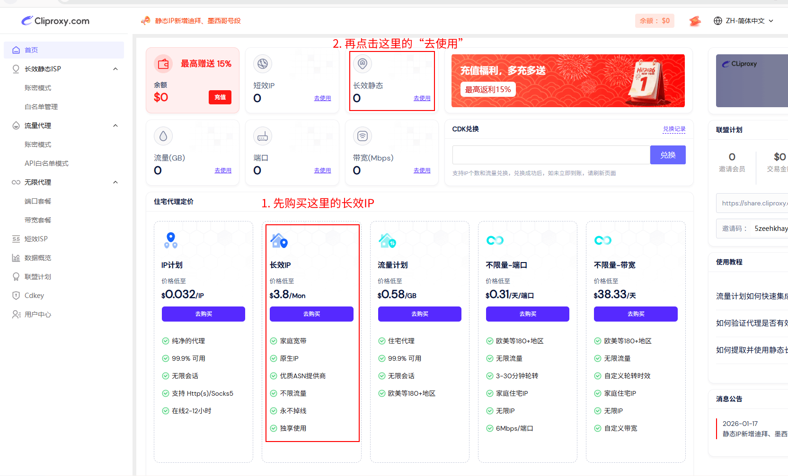
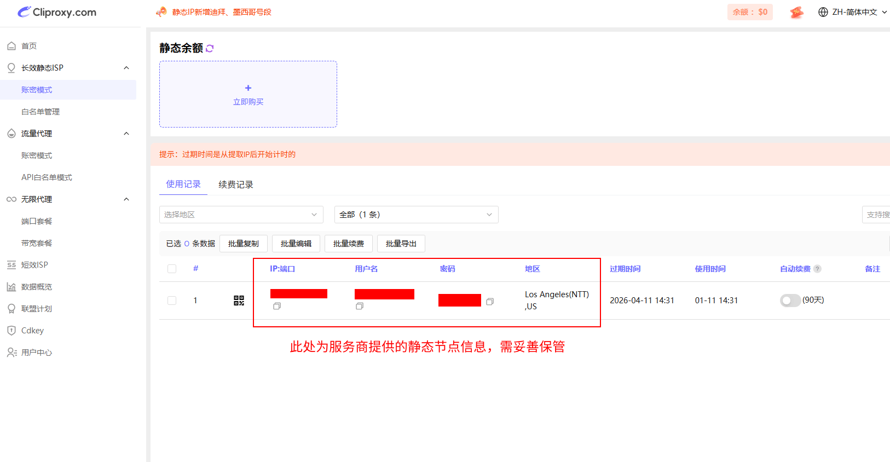

# 静态住宅IP链式代理完整配置指南

## 为什么需要这套方案

访问 Claude、ChatGPT 等 AI 服务时，即使翻越了 GFW，也常因 IP 被标记为"不纯净"（数据中心IP、被滥用的共享IP）而遭遇：
- 服务拒绝访问
- 明显降智（回答质量下降）
- 频繁要求验证

**解决思路**：在普通机场节点之后，再套一层"静态住宅IP"，让目标网站看到的是一个"美国家庭宽带用户"的真实IP。

---

## 第一章：核心概念解释

在购买服务之前，必须先搞清楚几个容易混淆的术语。

### 1.1 IP类型对比

#### 按来源分类

| 类型 | 来源 | 特点 | 价格 | 适用场景 |
|------|------|------|------|----------|
| **数据中心IP** | 云服务商机房（AWS、阿里云等） | 速度快，但容易被识别为"非真人" | 便宜 | 爬虫、批量任务 |
| **住宅IP** | ISP分配给家庭宽带用户 | 看起来像真人，不易被封 | 较贵 | AI服务、社媒运营 |

#### 按地域属性分类

| 类型 | 定义 | 说明 |
|------|------|------|
| **原生IP** | IP注册地与服务器物理位置一致 | 数据中心IP和住宅IP都可以是原生IP |
| **广播IP** | IP注册地与服务器物理位置不一致 | 如服务器在日本，IP注册地显示美国 |

**关键理解**：
- **原生IP ≠ 住宅IP**，原生只是说地域一致性
- 住宅IP几乎都是原生的（家庭宽带的IP注册地就是用户所在地）
- 数据中心IP可以是原生的（如AWS美国机房的IP注册在美国），也可以是广播的
- **原生IP的主要价值**：解锁流媒体等地区限制服务（Netflix、Spotify等）
- **住宅IP的主要价值**：模拟真实用户，避免被AI服务封禁

### 1.2 动态 vs 静态

| 类型 | 说明 | 适用场景 |
|------|------|----------|
| **动态住宅IP** | 每次连接或定时轮换IP | 爬虫、批量注册 |
| **静态住宅IP** | 固定不变，长期使用同一IP | AI服务、账号养护 |

### 1.3 该用哪种 IP？

**静态住宅IP（Static Residential IP）**，也叫 **ISP代理**：
- ✅ 来自真实ISP（如 Comcast、AT&T）
- ✅ 固定不变（不会每次连接都换）
- ✅ 独享（只有你一个人用）
- ✅ 美国地区优先（Claude/GPT对美国IP最友好）
- ✅ 基本上静态住宅IP都是原生的。
---

## 第二章：安装 Clash Verge Rev

### 2.1 为什么选择 Clash Verge Rev？

- 基于 **mihomo 内核**，完整支持 `dialer-proxy` 链式代理
- 支持 TUN 模式，接管全局流量（包括 API 调用）
- 支持 Merge 覆写，不破坏机场原始订阅
- 跨平台：Windows / macOS / Linux

目前最强大的代理客户端之一，适合本方案需求。

### 2.2 下载

**官方 GitHub 发布页面（推荐）**：
```
https://github.com/clash-verge-rev/clash-verge-rev/releases
```
这里面有各个版本的安装包，可供自身需求选择合适的版本。对于选择困难症的用户或者迷茫的新手小白，这里**推荐版本**：**v2.2.3**（稳定性和兼容性较好）

**下载链接**：
```
https://github.com/clash-verge-rev/clash-verge-rev/releases/tag/v2.2.3
```

**版本选择**：
- Windows x64：下载 `Clash.Verge_2.2.3_x64-setup.exe`
- Windows ARM：下载 `Clash.Verge_2.2.3_arm64-setup.exe`
- macOS Intel：下载 `Clash.Verge_2.2.3_x64.dmg`
- macOS Apple Silicon：下载 `Clash.Verge_2.2.3_aarch64.dmg`
- Linux：下载对应 `.deb` 或 `.AppImage`

> **提示**：如果v2.2.3出现兼容性问题，可以尝试最新的稳定性较好的版本或查看 [所有版本列表](https://github.com/clash-verge-rev/clash-verge-rev/releases)


### 2.3 安装

**Windows**：
1. 鼠标右键单击安装包，选择"以管理员身份运行"，接下来按提示安装，存放地址最好将其安装置于自定义路径（避免路径中有空格或中文），可以节省磁盘空间，同时易于管理。
2. 首次启动时允许防火墙权限。

### 2.4 配置 Windows 防火墙放行

为确保 Clash Verge Rev 及其内核 mihomo 能够正常工作（尤其是 TUN 模式和局域网共享），需要在 Windows 防火墙中放行相关程序。

#### 2.4.1 需要放行的程序

Clash Verge Rev 运行时主要涉及以下可执行文件（路径取决于你的安装位置）：

| 程序 | 说明 |
|------|------|
| `Clash Verge.exe` | Clash Verge Rev 主程序（GUI界面） |
| `mihomo.exe` | mihomo 代理内核（核心流量处理） |
| `mihomo-alpha.exe` | mihomo Alpha 版内核（如使用） |
| `verge-mihomo.exe` | Clash Verge 内置的 mihomo 内核 |

> **提示**：实际文件名可能因版本不同略有差异，请以安装目录下的实际文件为准。

#### 2.4.2 手动添加防火墙规则

1. 按 `Win + R`，输入 `wf.msc`，回车打开"高级安全 Windows Defender 防火墙"。
2. 左侧点击 **入站规则** → 右侧点击 **新建规则**。
3. 选择 **程序** → 下一步。
4. 选择 **此程序路径**，浏览并选择上述程序（如 `C:\Program Files\Clash Verge\Clash Verge.exe`）。
5. 选择 **允许连接** → 下一步。
6. 勾选 **域**、**专用**、**公用** 三个网络类型 → 下一步。
7. 输入名称（如 `Clash Verge - 入站`）→ 完成。
8. 同样的步骤，为 **出站规则** 也添加对应的放行规则。
9. 对 `mihomo.exe`、`verge-mihomo.exe` 等其他程序重复上述步骤。

#### 2.4.3 快捷方式：使用 PowerShell 批量添加

以**管理员身份**运行 PowerShell，执行以下命令（请根据实际安装路径修改）：

```powershell
# 定义 Clash Verge 安装目录（请修改为你的实际路径）
$clashPath = "C:\Program Files\Clash Verge"

# 需要放行的程序列表
$programs = @(
    "$clashPath\Clash Verge.exe",
    "$clashPath\resources\verge-mihomo.exe",
    "$clashPath\resources\mihomo.exe",
    "$clashPath\resources\mihomo-alpha.exe"
)

# 为每个程序添加入站和出站规则
foreach ($prog in $programs) {
    if (Test-Path $prog) {
        $name = [System.IO.Path]::GetFileNameWithoutExtension($prog)
        
        # 添加入站规则
        New-NetFirewallRule -DisplayName "Clash Verge - $name (Inbound)" `
            -Direction Inbound -Program $prog -Action Allow -Profile Any
        
        # 添加出站规则
        New-NetFirewallRule -DisplayName "Clash Verge - $name (Outbound)" `
            -Direction Outbound -Program $prog -Action Allow -Profile Any
        
        Write-Host "已添加规则: $name" -ForegroundColor Green
    } else {
        Write-Host "文件不存在，跳过: $prog" -ForegroundColor Yellow
    }
}

Write-Host "`n防火墙规则添加完成！" -ForegroundColor Cyan
```

#### 2.4.4 验证防火墙规则

1. 打开"高级安全 Windows Defender 防火墙"。
2. 分别查看 **入站规则** 和 **出站规则**。
3. 搜索 `Clash Verge`，确认相关规则已存在且状态为"已启用"。

> **注意**：如果使用了第三方安全软件（如火绒、360等），也需要在其防火墙设置中放行这些程序。

---

## 第三章：购买第一跳机场

第一跳的作用是**突破 GFW**，不需要高质量IP，只需稳定。

### 3.1 选择标准

- ✅ 月付 ¥15-30 足够
- ✅ 支持 Clash 订阅链接
- ✅ 有多地区节点（美国/日本/新加坡）
- ✅ 稳定运营，不频繁跑路
- ❌ **不需要**在乎IP质量（反正只是中转）

### 3.2 购买后获取

购买完成后，你会得到一个**订阅链接**，类似：
```
https://example.com/api/v1/client/subscribe?token=xxxxx
```

**请妥善保存这个链接**，后续需要导入到 Clash Verge。

---

## 第四章：Clash Verge 基础配置

### 4.1 导入机场订阅

1. 打开 Clash Verge，点击左侧菜单 → **订阅**。 将之前购买的机场订阅链接复制粘贴到最上方的输入框 **"订阅文件链接"**中，点击**导入**即可。
2. 每导入一个订阅链接后,下方会自动生成一个对应的订阅卡片，这些卡片支持拖拽排序。每个卡片上的卡片信息包含着代理服务提供商（机场）名称、流量用量、上次更新时间等信息。
3. 当拥有多个订阅卡片时,可以直接点击卡片来激活对应的服务商订阅(被选中的卡片会显示蓝色高亮边框)。


### 4.2 选择节点和基础设置

1. 左侧菜单 → **首页**，观察首页右上方的"当前节点"板块，在右上方的板块中，"代理组"可以在下拉菜单中选择不同的代理组，然后再在"代理组"下方的"节点"下拉菜单中选择具体的节点进行连接测试和使用。
3. 或者可以在左侧菜单 → **代理**，将策略组下拉菜单点开之后，再选择具体的节点进行连接测试和使用。
4. "首页"菜单左侧中间"网络设置"板块 → 点击 **系统代理** → 开启；
5. "首页"菜单左侧中间"网络设置"板块 → 点击 **虚拟网卡模式** → 开启，这样可以劫持所有流量，包括 API 调用和命令行；该功能视个人需要而选择是否开启，开启之后，即使不走系统代理的流量——如终端或其他不遵循系统代理设置的软件——也会被强制接管转发。


### 4.3 模式与基础设置

正式启用前，先了解 Clash 的三种主要代理模式，选最适合日常使用的一种：

| 模式 | 名称 | 说明 | 适用场景 |
|------|------|------|----------|
| **规则** | **Rule** | **【推荐】** 根据配置文件中的规则列表智能分流。访问 Google 走代理，访问百度直连。 | **日常首选**。既能科学上网，又不影响国内访问速度。 |
| **全局** | Global | 所有流量强制走代理（忽略规则）。 | 遇到规则未覆盖的冷门外网，或临时排查网络问题时。 |
| **直连** | Direct | 所有流量都不走代理。 | 相当于暂停代理服务。 |

**操作指引**：

进入"首页"菜单，找到右侧中间的"代理模式"板块，点击选择 **规则（Rule）**。这样系统就会根据预设规则自动处理流量；

或者如下图所示，点开左侧菜单中的**代理**，在右上角选择代理模式为**规则（Rule）**。


### 4.4 杂项设置

按照图中所示，点击左侧菜单中的**设置**，在设置界面中，可以大致参考下图，开启这些选项，不过这里面并不是每个选项开关都是必须开启或关闭的，这里面需要开启的，大概有以下几个：

1. 系统代理开关：一定要开启
2. 虚拟网卡模式：建议开启，不开启的话，虽然也能代理浏览器流量，但终端等其他软件的流量就无法被劫持
3. DNS 覆写：默认开启即可


至此，Clash Verge 的基础配置已完成。下面是原理部分。

---

## 第五章：原理解析

在进入链式代理配置之前，理解以下概念和工作流程非常重要。这些知识将帮助你理解为什么需要链式代理，以及它是如何工作的。

### 5.1 概念解析：节点与服务器

很多人会混淆"节点"和"服务器"这两个词，但实际上它们处于不同的抽象层次。

服务器是一个物理或虚拟的计算实体，它真实存在于某个数据中心或机房里，有自己的 CPU、内存、硬盘和网络接口。比如"一台位于东京的服务器"，指的是一台实实在在运行着的机器，它有固定的 IP 地址，上面可能跑着各种服务程序。服务器是基础设施层面的概念，是承载一切网络服务的硬件载体。

而节点则是对「一个可用连接」的抽象，它把建立通信连接所需的所有参数封装成一个单元：地址、端口、协议、密码、加密方式等。对用户来说，不用关心背后是什么硬件、怎么部署的，只需要知道「选这个节点就能连通」。节点是应用层面的概念，是用户与代理服务交互的最小操作单位。

一台服务器可以对外提供多个节点。比如同一台机器上可能同时运行了 Shadowsocks、VMess、Trojan 三种代理协议，分别监听不同端口，那么这台服务器就对外暴露了三个节点。用户在客户端里看到的是三条独立的连接选项，但它们背后其实共享同一套硬件资源。反过来，一个节点背后也不一定只有一台服务器——服务商为了提高可用性和承载能力，经常会用多台服务器组成集群，再通过负载均衡把流量分散到各台机器上。用户连接这个节点时，实际被分配到哪台服务器是动态决定的，但这对用户完全透明。

这种抽象的好处是屏蔽了底层复杂性。一个节点背后可能是单台服务器、可能是一组负载均衡的集群、可能是套了 CDN 的中转架构，但在用户视角它就是列表里的一行，能连就用、不能连就换。你不需要知道服务商的机房在哪里、用了什么硬件、怎么做的故障转移，只需要关心这个节点能不能连上、速度快不快、延迟高不高。这就是节点作为最小操作单位的意义——它把复杂的后端架构简化成一个可选择、可切换的连接入口。

在本文的链式代理场景中，这种区分尤为重要。当你配置 `dialer-proxy` 时，你操作的对象是节点而非服务器。你告诉 Clash"让静态住宅IP这个节点通过机场出口这个节点去连接"，至于机场出口背后是一台还是一百台服务器、静态住宅IP服务商用的是什么机房，都不影响你的配置逻辑。

| 概念 | 定义 | 层次 | 举例 |
|------|------|------|------|
| **服务器** | 真实运行的物理或虚拟计算设备 | 基础设施层 | 一台位于东京的 VPS、AWS 上的 EC2 实例 |
| **节点** | 封装了连接参数的可用连接入口 | 应用层 | 订阅列表里的"日本-东京-01" |
| **关系** | 一台服务器可提供多个节点；一个节点背后也可能是服务器集群 | — | 同一服务器开放 SS/VMess/Trojan 三个节点 |


### 5.2 订阅界面右上角三个图标的功能解析


<div align="center">
  
</div>


**1. 🔄 刷新图标 (循环箭头)**
- **功能**: 刷新所有订阅
- **本质**：下载/同步
- **作用**: 

    当你购买代理服务后，服务商会给你一个订阅链接（通常是一个 URL）。这个链接指向服务商服务器上的一个订阅文件，也就是节点列表的配置文件，里面包含了所有可用节点的详细信息：服务器地址、端口、加密协议、密码等。

    点击刷新图标时，Clash 会去访问你购买服务时获得的 URL，把服务器上最新的节点信息抓取下来，覆盖掉你本地旧的配置文件，让代理内核读取这个文件并开始工作（应用）
    
    为什么需要定期刷新？因为代理服务商会持续维护他们的节点：有些节点可能被封锁需要下线，有些节点会更换 IP 或端口，服务商也可能新增更快的线路或调整负载均衡策略。如果你不刷新，本地保存的还是旧配置，可能会连接到已经失效的节点。
    
   
- **使用场景**:  如果你同时使用多家服务商或者一个账号有多个订阅（比如按地区分类），界面上会显示多个订阅卡片。顶部的刷新按钮可以一次性更新所有订阅，省去逐个点击的麻烦。批量更新所有已导入的订阅链接,一键从服务器拉取最新的节点配置。

**2. 📄 文档图标 (文件/列表)**
- **功能**: 查看运行时的本地 clash verge.yaml 配置文件
- **作用**: 查看当前正在使用的订阅配置文件内容,可以看到实际运行的 clash verge.yaml 配置
- **使用场景**: 用于调试、查看配置详情或检查配置是否正确加载

**3. 🔥 火焰图标 (蓝色)**
- **功能**: 重新激活订阅 (Reload/Reactivate)
- **作用**: 不重新下载，而是让内核重新加载并激活已有的配置文件
- **使用场景**: 当修改了配置、切换了订阅或遇到代理异常时,点击这个按钮可以重新加载配置使其生效

**关键区别:**
- **刷新(🔄)** = 从服务器下载新配置(更新)
- **重新激活(🔥)** = 重新加载已有配置到内核(应用)

简单来说:刷新是"下载更新",重新激活是"应用配置"。

### 5.3 机场订阅的共享模式

大多数机场（代理服务商）的运营模式是**共享节点**，也就是说同一批服务器资源会被多个用户使用，体现在用户端层面就是大家拿到的节点列表基本是一样的。

服务商会部署一批服务器分布在不同国家和地区，然后把这些节点配置信息打包成一个订阅文件，通过分发订阅链接卖给用户。所有购买了同一套餐的用户拿到的订阅链接里，节点列表基本是一样的，大家共享这些服务器资源。

这种共享模式意味着几件事：节点的速度和稳定性会受其他用户影响，高峰期可能变慢；如果有用户用这些节点做了违规操作，可能导致整个 IP 被目标网站封禁，影响所有人；服务商通常会用流量限制或套餐分级来控制拥挤程度，贵的套餐可能有专属节点或更少人共享。

这也是为什么有些用户会选择自建节点——自己租一台 VPS 搭建代理，IP 独享，不受他人影响，但需要自己维护，成本和技术门槛也更高。

### 5.4 完整工作流程

**1. 服务商部署基础设施**

服务商在境外部署代理服务器，每台服务器运行代理服务（Shadowsocks、Trojan、VMess 等协议），监听特定端口，配置好加密方式和认证密码。

**2. 用户获取订阅**

用户购买服务后，得到一个订阅链接（URL）。这个链接指向服务商服务器上的一个配置文件，里面包含所有可用节点的连接信息，以及服务商预设的策略组和分流规则。

**3. 导入与存储**

用户在 Clash Verge 中导入订阅链接，clash 访问该 URL，下载配置文件，保存到 Clash Verge 本地 profiles 文件夹中，一般具体位置是C:\Users\Administrator\AppData\Roaming\io.github.clash-verge-rev.clash-verge-rev\profiles。

用户每导入一个订阅，就生成一个独立的 yaml 文件放在该文件夹中，同时在前端UI的"订阅"页面生成一个订阅卡片，此时内核还未读取，只是存档。

**4. 激活与合并**

当用户在前端UI的"订阅"页面中点击某张订阅卡片激活它，Clash Verge 就会启动配置合并流程。这个流程是 Clash Verge 强大功能的核心，它允许用户在不修改原始订阅的情况下，叠加自定义配置。

**配置合并的完整执行链路**如下：

```
┌─────────────────────────────────────────────────────────────────┐
│                    Clash Verge 配置执行链路                      │
├─────────────────────────────────────────────────────────────────┤
│                                                                  │
│  ① 原始订阅配置                                                  │
│     └─→ 通过订阅链接下载的机场原始 yaml 文件                      │
│              ↓                                                   │
│  ② 全局扩展配置 (Merge.yaml)                                     │
│     └─→ 覆写基础设置：端口、TUN、DNS 等                           │
│              ↓                                                   │
│  ③ 全局扩展脚本 (Script.js)                                      │
│     └─→ 动态修改：添加节点、策略组、规则等                         │
│              ↓                                                   │
│  ④ 当前订阅的专属 Merge 配置                                     │
│     └─→ 针对该订阅的特定覆写（可选）                              │
│              ↓                                                   │
│  ⑤ 当前订阅的专属 Script 配置                                    │
│     └─→ 针对该订阅的特定脚本（可选）                              │
│              ↓                                                   │
│  ⑥ 生成运行时配置 (clash verge.yaml)                            │
│     └─→ 最终合并结果，供 mihomo 内核读取                          │
│              ↓                                                   │
│  ⑦ Mihomo 内核加载配置并运行                                     │
│                                                                  │
└─────────────────────────────────────────────────────────────────┘
```

**各层配置的作用说明**：

| 层级 | 配置类型 | 作用范围 | 典型用途 |
|------|----------|----------|----------|
| ① | 原始订阅 | 基础 | 机场提供的节点、规则 |
| ②③ | 全局扩展 | 所有订阅 | 本项目的链式代理配置 |
| ④⑤ | 订阅专属 | 单个订阅 | 针对特定机场的调整 |

**本项目使用的是全局覆写扩展配置文件和全局扩展脚本（②③）**，这意味着无论你激活哪个机场订阅，链式代理功能都会自动生效。

**5. 内核工作**

Mihomo 内核读取运行时配置 clash verge.yaml ，开始监听本地端口。内核通过系统代理或 TUN 模式劫持流量之后，内核对每个连接进行规则匹配（根据目标域名、IP、进程名等），决定该连接走哪个策略组，策略组再指向具体节点，流量最终通过该节点的境外服务器中转后到达目的地，或者直连不经过代理。

### 5.5 为什么需要链式代理？

理解了上述原理后，我们来看我们为什么需要链式代理：

1. **机场节点的局限性**：机场提供的节点 IP 通常是数据中心 IP，且被大量用户共享，容易被 AI 服务识别并限制。

2. **链式代理的思路**：在机场节点（第一跳，负责突破 GFW）之后，再加一层静态住宅 IP（第二跳，负责提供干净的出口 IP）。

3. **流量路径**：
   ```
   你的电脑 → 机场节点（过墙） → 静态住宅IP服务器 → 目标网站
   ```

4. **目标网站看到的是**：一个来自美国家庭宽带的真实住宅 IP，而不是数据中心或被滥用的共享 IP。


这就是本项目要实现的核心功能。下面开始购买静态住宅 IP 并配置链式代理。


你可能要问：为什么不直接买静态住宅 IP 作为第一跳？答案是：静态住宅 IP 本身无法突破 GFW，必须先通过机场节点才能访问境外网站。


---

## 第六章：购买第二跳静态住宅IP

### 6.1 服务商对比

| 服务商 | 价格 | 特点 | 推荐度 |
|--------|------|------|--------|
| **IPRoyal** | ~$2.5/IP/月 | 性价比高，美国IP充足，支持SOCKS5 | ⭐⭐⭐⭐⭐ |
| **Proxy-Cheap** | ~$3/IP/月 | 口碑好，稳定 | ⭐⭐⭐⭐ |
| **CliProxy** | ~$3-5/IP/月 | 国内用户较多 | ⭐⭐⭐⭐ |
| **LunaProxy** | 按流量计费 | IP池大，灵活 | ⭐⭐⭐ |
| **Webshare** | ~$6/月起 | 高速，支持SOCKS5 | ⭐⭐⭐ |

这里推荐**CliProxy**和**IPRoyal**，两者价格合理且口碑不错。本文以**cliproxy.com**为例进行演示。

网站链接为
```
https://dash.cliproxy.com/cli/home
```
 

### 6.2 购买

如下图所示，购买图中红框内的静态住宅IP套餐即可：购买完成后，如下图所示点击红框中的长效静态选框，点击"去使用"，即可跳转到控制台页面，查看和获取节点信息。




### 6.3 获取节点信息

服务商会提供：
```
服务器地址：us.example.com 或 1.2.3.4
端口：12345
用户名：your_username
密码：your_password
协议：SOCKS5
```

**请记录这些信息**，后续配置需要用到。




---


## 第七章：配置链式代理


1. 点击 Clash Verge 左侧菜单中的**设置**，在设置界面中，向下滑动，点击"配置目录"这一选项，打开配置文件夹。
2. 该文件夹一般位于：
   ```
   C:\Users\Administrator\AppData\Roaming\io.github.clash-verge-rev.clash-verge-rev
   ```
其中AppData文件夹是隐藏的，如果你看不到，可以在文件夹选项中开启"显示隐藏的文件、文件夹和驱动器"选项。

3. 将本项目提供的两个配置文件 `Merge.yaml` 和 `Script.js` 复制到该配置目录下的 `profiles` 文件夹中。
4. 点击 Clash Verge 左侧菜单中的**订阅**，在订阅页面中，双击"全局扩展脚本"这一选项，修改以下三处代码：


第一处，将type、server、port、username、password字段替换为你购买的静态住宅IP节点信息（不要幻想白嫖，我下面这个数字是瞎填的），然后你要考虑一个问题，你是否希望把这个静态住宅IP节点的名字改掉，我这里自定义的名字为"原生静态住宅IP-美国洛杉矶"，你自定义别的名字不错，但是一旦改了名字，后续还有两处代码要改，同时还得注意不能和机场节点名字冲突，否则会报错。

新手推荐别改"name"字段，这样的话，后续两处代码都不用改，直接照搬即可。


```javascript


  const customProxies = [
    // ┌─────────────────────────────────────────────────────────────────────┐
    // │  原生静态住宅IP - 美国洛杉矶                                          │
    // │  用途: 链式代理的二级跳，提供干净的住宅 IP                              │
    // │  关键: dialer-proxy 指定通过哪个策略组连接此节点                       │
    // └─────────────────────────────────────────────────────────────────────┘
    {
      "name": "原生静态住宅IP-美国洛杉矶",
      "type": "socks5",
      "server": "50.3.64.199",
      "port": 443,
      "username": "MiWRJgdwgjVg",
      "password": "ScrJQJjV9h",
      "dialer-proxy": "美日自动-链式代理一级跳",  // ← 链式代理的核心！
      "skip-cert-verify": true
    },

```


第二处，这是建立在你修改了第一处代码的前提下，如果你没有修改第一处代码的"name"字段，那么这里也不用改，直接照搬即可。
将下面这段代码中的这一行代码"filter": "^(?!.*原生静态住宅IP)(?i).*(美国|US|United States|日本|JP|Japan|🇺🇸|🇯🇵)"中的原生静态住宅IP这几个字换成你自己刚刚在第一处自定义的名字

```javascript

  const customProxyGroups = [
    // ┌─────────────────────────────────────────────────────────────────────┐
    // │  美日自动-链式代理一级跳                                              │
    // │  用途: 故障转移，优先使用美国/日本可用节点作为第一跳                  │
    // │  类型: fallback（故障转移）                                          │
    // │  注意: 必须排除静态住宅节点本身，防止死循环                            │
    // └─────────────────────────────────────────────────────────────────────┘
    {
      "name": "美日自动-链式代理一级跳",
      "type": "fallback",
      // ─── include-all-proxies ───
      // mihomo 特有字段，自动包含 config.proxies 中的所有节点
      // 注意：必须是 "include-all-proxies"，不是 "include-all"
      "include-all-proxies": true,
      // ─── filter 正则过滤 ───
      // 从所有节点中筛选出美国/日本节点，同时排除静态住宅节点
      // (?!.*原生静态住宅IP) = 负向预查放最前，排除节点名包含"原生静态住宅IP"的节点
      // (?i) = 忽略大小写
      // (美国|US|...) = 匹配包含这些关键词的节点名
      "filter": "^(?!.*原生静态住宅IP)(?i).*(美国|US|United States|日本|JP|Japan|🇺🇸|🇯🇵)",
      // ─── url 测速地址 ───
      // 【重要】不能使用 gstatic.com！因为它在规则中被分配到链式代理，会造成死循环：
      //   测速 → gstatic.com → 静态住宅-链式代理 → 需要一级跳 → 需要测速 → 死循环
      // 使用 Cloudflare 的测速地址，该域名不在链式代理规则中
      "url": "http://cp.cloudflare.com/generate_204",
      "interval": 300       // 每 5 分钟健康检查一次
    },


```

第三处，这是建立在你修改了第一处代码的前提下，如果你没有修改第一处代码的"name"字段，那么这里也不用改，直接照搬即可。
将下面这段代码中的这一行代码"proxies": ["原生静态住宅IP-美国洛杉矶"]中的原生静态住宅IP-美国洛杉矶这几个字换成你自己刚刚在第一处自定义的名字

```javascript


   {
      "name": "静态住宅-链式代理",
      "type": "select",
      "proxies": ["原生静态住宅IP-美国洛杉矶"]
      // 如果以后有多个住宅节点，在这里添加:
      // "proxies": ["原生静态住宅IP-美国洛杉矶", "其他住宅节点"]
    },


```

5. 结束修改完成后，保存脚本，返回 Clash Verge 订阅页面，点击右上角的蓝色**🔥火焰图标**重新激活订阅，使修改生效。


## 第八章：理解规则集与覆写机制

> ⚠️ **版本提示（务必先读）**：本章用 `prepend-rules` 讲解"规则前插 / 优先级"的**概念**，但 **Clash Verge Rev v1.7.x 起，在 Merge / 扩展配置里写 `prepend-rules`、`append-rules` 已失效**（v2.x 实测无效，见官方 [issue #3150](https://github.com/clash-verge-rev/clash-verge-rev/issues/3150)，维护者明确回复"无效"）。规则现在通过两种方式添加：
>
> 1. **扩展脚本 Script.js**（本文档**第十章**的做法，用 `config.rules.unshift(...)` 把自定义规则插到最前）；
> 2. 订阅卡片**右键 →「编辑规则」**可视化编辑器。
>
> 所以下文的 `prepend-rules` 示例**仅用于理解优先级原理**，真正落地请照第十章。本项目的 `Merge.yaml` 也已注明这点。

### 8.1 机场订阅自带的规则集

当你导入机场订阅后，订阅文件中通常已经包含：
- **proxies**：节点列表
- **proxy-groups**：节点分组
- **rules**：分流规则（哪些域名走代理，哪些直连）

这些规则会决定你的流量走向，比如：
```yaml
rules:
  - DOMAIN-SUFFIX,google.com,PROXY
  - DOMAIN-SUFFIX,baidu.com,DIRECT
  - GEOIP,CN,DIRECT
  - MATCH,PROXY
```

### 8.2 为什么需要覆写？

问题来了：
1. 机场订阅更新后，你手动改的内容会被覆盖
2. 你想加自定义规则（比如让 Claude 走静态住宅IP），但不想破坏原有配置

**解决方案**：在订阅原有规则前**追加高优先级的自定义规则**（v2.x 的正确实现见上方版本提示与**第十章** Script.js）。

### 8.3 Merge 覆写的工作原理

> 注：下面的 `prepend-xxx` 语法在 **v1.7.x 之前**有效，现已失效，仅作优先级原理说明（实现见第十章 Script.js）。

Merge（扩展配置）在**订阅加载后、规则生效前**，把你的自定义内容"合并"进去。

关键语法：
- `prepend-xxx`：**前插**（插到原有内容**前面**，优先级更高）
- `append-xxx`：**后追加**（加到原有内容**后面**）

例如：
```yaml
prepend-rules:
  - DOMAIN-SUFFIX,claude.ai,AI服务
```
这条规则会被插到机场原有 rules 的**最前面**，因此优先级最高。

### 8.4 规则冲突与优先级

**规则匹配是自上而下的**，一旦命中就停止匹配。

假设机场订阅有：
```yaml
rules:
  - GEOIP,CN,DIRECT
  - MATCH,PROXY  # 兜底：其他全走代理
```

你用 `prepend-rules` 插入：
```yaml
prepend-rules:
  - DOMAIN-SUFFIX,claude.ai,纯净出口
```

最终生效的规则顺序：
```yaml
rules:
  - DOMAIN-SUFFIX,claude.ai,纯净出口  # ← 你插入的，最高优先级
  - GEOIP,CN,DIRECT                    # ← 机场原有
  - MATCH,PROXY                        # ← 机场原有兜底
```

**结论**：`prepend-rules` 不会"覆盖"机场规则，而是在前面"插队"，获得更高优先级。

### 8.5 不要在 prepend-rules 里放 MATCH

如果你写：
```yaml
prepend-rules:
  - DOMAIN-SUFFIX,claude.ai,纯净出口
  - MATCH,我的代理  # ❌ 错误！
```

`MATCH` 会匹配**所有流量**，导致机场原有的规则全部失效！

**正确做法**：只在 `prepend-rules` 里放你想优先处理的特定规则，让机场的 `MATCH` 作为兜底。

---

## 第九章：配置 dialer-proxy 链式代理

### 9.1 dialer-proxy 是什么？

`dialer-proxy` 是 mihomo 内核的功能，它让一个代理节点"借道"另一个代理出站。

```
流量 → 静态住宅IP节点 --dialer-proxy--> 机场节点 → 目标网站
```

意思是：静态住宅IP节点本身无法直接连接（因为它在墙外），所以让它先通过机场节点建立连接。

### 9.2 与 relay 的区别

| 方式 | 原理 | 状态 |
|------|------|------|
| `relay` | 代理组类型，流量依次经过多个节点 | **即将废弃** |
| `dialer-proxy` | 节点属性，指定该节点通过哪个出口连接 | **推荐使用** |

mihomo 官方文档明确说明：**relay 即将废弃，请使用 dialer-proxy**。

### 9.3 配置逻辑图

```
┌─────────────────────────────────────────────────────────────┐
│                        Clash Verge                          │
├─────────────────────────────────────────────────────────────┤
│  规则匹配：                                                   │
│    claude.ai → "纯净出口" 组                                  │
│                    ↓                                         │
│           "静态住宅-美国" 节点                                 │
│                    ↓                                         │
│        dialer-proxy: "机场出口"                              │
│                    ↓                                         │
│           机场订阅中的某个节点                                 │
│                    ↓                                         │
│               突破 GFW                                       │
│                    ↓                                         │
│           静态住宅IP服务器                                    │
│                    ↓                                         │
│              目标网站                                        │
└─────────────────────────────────────────────────────────────┘
```

---

## 第十章：部署本项目配置（核心）

本项目提供了两个配置文件，分别用于全局配置覆写和链式代理逻辑实现。

### 10.1 准备工作

1.  确保已安装 **Clash Verge Rev** 并导入了基础的机场订阅。
2.  确保已下载本项目的 `Merge.yaml` 和 `Script.js` 文件。
3.  准备好你的静态住宅IP信息（服务器地址、端口、用户名、密码）。

### 10.2 部署 Merge.yaml (全局基础覆写)

`Merge.yaml` 主要负责设置 TUN 模式、混合端口、DNS 劫持等基础环境，确保 Clash 能接管所有流量。

1.  打开 Clash Verge Rev。
2.  进入 **设置 (Settings)** -> **全局扩展配置 (Global Extension Configs)**。
3.  点击 **新建 (New)**，类型选择 `Merge`。
4.  名称填写：`Global_Config`（或任意你喜欢的名字）。
5.  在编辑器中，直接清空原有内容，并将本项目提供的 `Merge.yaml` 文件内容完整复制进去。
6.  点击 **保存**。

### 10.3 部署 Script.js (链式代理核心)

`Script.js` 是实现链式代理的核心。它会动态添加静态住宅IP节点，并定义流量如何通过机场节点中转。

#### 9.3.1 修改 Script.js

在部署之前，你需要将你的静态住宅IP信息填入 `Script.js`。

1.  用文本编辑器（如 Notepad, VS Code）打开 `Script.js`。
2.  找到 `const customProxies = [...]` 部分。
3.  修改第一个节点的配置：
    - `server`: 填入你的静态IP地址
    - `port`: 填入端口
    - `username`: 填入用户名
    - `password`: 填入密码
    - `dialer-proxy`: 保持默认 `"美日自动-链式代理一级跳"`，该设置指定了流量必须先经过机场节点。

#### 9.3.2 导入 Script.js

1.  回到 Clash Verge Rev。
2.  进入 **设置 (Settings)** -> **全局扩展脚本 (Global Extension Scripts)**。
3.  点击 **新建 (New)**。
4.  名称填写：`Chain_Proxy_Script`。
5.  在编辑器中，清空原有内容，将你修改好的 `Script.js` 内容完整复制进去。
6.  点击 **保存**。

### 10.4 启用配置

1.  在 **全局扩展配置** 列表中，找到 `Global_Config`，启用开关。
2.  在 **全局扩展脚本** 列表中，找到 `Chain_Proxy_Script`，启用开关。
3.  回到 Clash Verge 主界面，右键你的机场订阅或者点击右上角的 **刷新 (Reload Config)** 按钮。

---

## 第十一章：使用与验证

### 11.1 检查策略组

配置生效后，在 **代理 (Proxies)** 界面会出现新的策略组：

1.  **美日自动-链式代理一级跳**：
    - 脚本会自动从你的机场订阅中筛选美国和日本节点，并自动选择最快的。
    - 这是链式代理的第一跳（过墙）。

2.  **静态住宅IP-美国洛杉矶** (或你在脚本中定义的名字)：
    - 这是你的静态住宅IP节点。
    - 它的流量会强制通过 "美日自动-链式代理一级跳"。

### 11.2 验证 IP

1.  切换 Clash Verge 为 **规则模式 (Rule)**。
2.  在浏览器访问 `https://ipinfo.io`。
    - 如果显示的是机场IP，说明普通流量正常走了机场。
3.  在浏览器访问 `https://chatgpt.com` 或 `https://claude.ai`。
4.  在 Clash Verge 的 **连接 (Connections)** 面板查看该请求：
    - 确认规则命中了 `Rule(AI服务)`（或其他自定义规则）。
    - 确认链路为：`静态住宅IP` -> `美日自动-链式代理一级跳` -> `机场节点`。

---

## 第十二章：常见问题排查

### 12.1 无法连接 / 所有的节点都超时

- 检查 `Script.js` 中的 IP、端口、账号密码是否正确。
- 确认 `Merge.yaml` 中的 `ipv6: false` 已生效（防止 IPv6 泄露或连接问题）。
- 单独测试机场节点是否通畅。

### 12.2 Script.js 报错

- 检查 JSON 格式是否正确（逗号、引号）。
- 确保 `dialer-proxy` 指向的策略组名称在 `customProxyGroups` 中已定义。

---

## 附录：成本估算

| 项目 | 月费 | 备注 |
|------|------|------|
| 机场订阅 | ¥15-30 | 基础套餐即可 |
| 静态住宅IP | $2.5-5（≈¥18-36） | 1个美国IP |
| **合计** | **¥35-65/月** | |

---

## 附录：术语表

| 术语 | 解释 |
|------|------|
| GFW | 中国防火墙，阻止访问境外网站 |
| dialer-proxy | 指定节点通过另一个代理出站（链式代理核心）|
| Merge | 全局配置覆写 |
| Script | 动态配置脚本 |
| ISP | 互联网服务提供商 |
